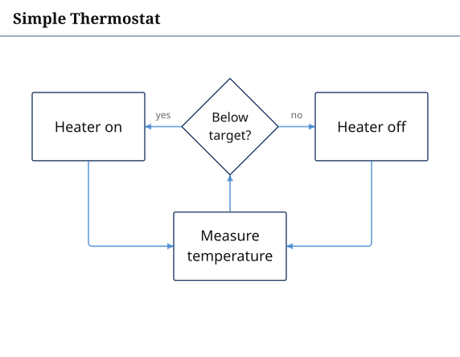

# Line9 skill

Teaches a coding agent to render Mermaid diagrams with [Line9](https://line9.ai).

Line9 renders the Mermaid you already write with its own layout engine — same
`.mmd` source, cleaner placement, orthogonal edge routing and typography.

The same five-line `.mmd` source, rendered by stock Mermaid (left) and Line9 (right):

<table>
<tr><th>Mermaid</th><th>Line9</th></tr>
<tr>
<td align="center" valign="middle"></td>
<td align="center" valign="middle"></td>
</tr>
</table>

## Install

```sh
npx skills add line9-ai/line9-skill
```

Or, in Claude Code, as a plugin from this repository.

## What it does

The skill tells your agent to check for the `line9` CLI, fall back to
`npx line9@latest` if it is missing, run `line9 bootstrap` for the full
authoring guidance, and render with `line9 render <file>.mmd`.

`SKILL.md` is a short pointer rather than a copy of the authoring guidance; `line9 bootstrap` installs the guidance that matches your CLI version.

- **This repository contains no engine source.** It is a few text files. The
  skill makes your agent run a downloaded binary (the `line9` CLI, via npm).
- Line9 is not open source, but it is free to use. The free CLI is for personal
  use and adds a watermark to its output. Your Mermaid source is always yours.
- The licence in this repository covers the wrapper text only.

More at [line9.ai](https://line9.ai) and [line9.ai/mermaid](https://line9.ai/mermaid).
